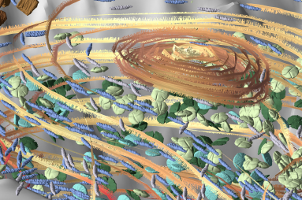

# SculptingVis

## Developer Dependencies
[Sass](https://sass-lang.com/) is the only dependency used. Click [here](https://sass-lang.com/install) to install Sass.

To allow sass to track changes and generate css to the `dist` folder, run `sass --watch ./sass:dist/css`.

Sass is a developer dependency. Styling changes will be exported to the `dist` folder in the file tree.

## Page Assets
Here are a list of re-usable assets for each thrust and application page. Unique sections are usually marked with a css `id` instead of a`class`.

### Paragraph Sizing
There are two sizes at the moment: `Regular` and `Big-Text`. The use of these can help create emphasis for important ideas.
The default size is regular. To make a big-text paragraph, add `class="big-paragraph"` to the opening `
` html tag:

    
Sculpting Visualization is a research project

### Images
**Hero Image**
The hero image is the big image that users see when they first land on the page. This lives at the top of the `#page-container`:

    

    	
    

**Single Paragraph Image**
For a single image, insert this code snippet anywhere directly inside the `#content` container:

    

    	

    	
    	<h5>Fig. of a really badass render to show how color should be used to graph field data.</h5>
    	

    

**Double Paragraph Image**
For two images side-by-side in a paragraph, use this directly in the `#content`container:

    

    	

    		
    		<h5>Other cool things.</h5>
    	

    	

    		
    		<h5>Hey this is information that is cool and important.</h5>
    	

    

It is recommended to use `.jpg` image types, as they reduce page load times.

### Contributors
These are the people who contributed to the thrust or application. Hyperlinks are optional.

    

    	<h3>Contributors</h3>
    	<ul>
    		<li>Stephanie Zeller</li>
    		<li><a href="links go here">Francesca Samsel</a></li>
    		<li><a href="#">Greg Abram</a></li>
    		<li><a href="#">Daniel Keefe</a></li>
    	</ul>
    

### Sources
It's highly encouraged to upload the cited article to the `publications` folder.

    

    	<h3>Sources</h3>
    	<ul>
    		<li>
    			<h4><a href="link to article here">Antarctic Water Masses and Ice Shelves Visualizing the Physics</a><a  class="doi" href="doi link goes here">DOI</a></h4>
    			
Greg Abram, Francesca Samsel, Mark R Petersen, Xylar Asay-Davis, Darin Comeau, Stephen F Price  
    			<i>IEEE Computer Graphics and Applications, 2021</i>

    		</li>
    	</ul>
    

### Sidebar
The sidebar sits on the left side of the page. Users can click each item to navigate to the corresponding section on the page.

I recommend filling this section out last.

    

    	

    		<h1>Planetariums</h1>
    		<h2>Camera Tracking</h2>
    		<ul>
    			<li><a href="#overview">Thrust Overview</a></li>
    			<li><a href="#physicalization">1. Physicalization of Physical Particles</a></li>
    			<li><a href="#following-po">2. Following Physical Objects</a></li>
    			<li><a href="#future-obj">3. Future Objects to Follow</a></li>
    			<li><a href="#contributors">Contributors</a></li>
    			<li><a href="#sources-support">Sources and Support</a></li>
    		</ul>
    	

    

